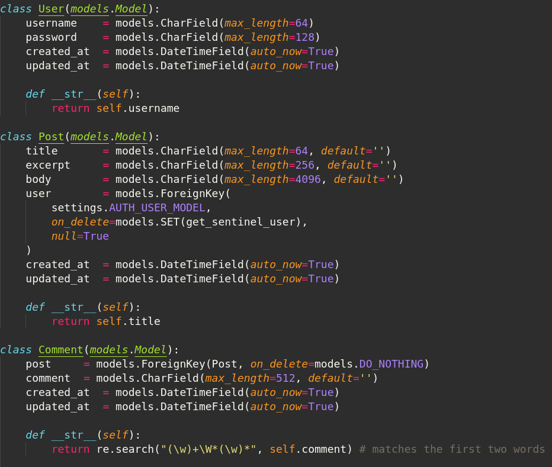

# Django + Graphene App

Tutorial to make a Python Django API with GraphQL

## Useful guides

* Django *hello world*: [https://docs.djangoproject.com/en/2.1/intro/tutorial01/](https://docs.djangoproject.com/en/2.1/intro/tutorial01/)
* Django + graphene *hello world*: [https://docs.graphene-python.org/projects/django/en/latest/tutorial-plain/](https://docs.graphene-python.org/projects/django/en/latest/tutorial-plain/)
* Django youtube tutorial [https://www.youtube.com/watch?v=FNQxxpM1yOs](https://www.youtube.com/watch?v=FNQxxpM1yOs)

## Installation

### 1. Install python

#### Windows

* [https://www.python.org/downloads/](https://www.python.org/downloads/)
* Direct: [https://www.python.org/ftp/python/3.7.1/python-3.7.1-amd64.exe](https://www.python.org/ftp/python/3.7.1/python-3.7.1-amd64.exe)

#### Mac

* [https://www.python.org/downloads/mac-osx/](https://www.python.org/downloads/mac-osx/)
* [https://www.python.org/ftp/python/3.7.1/python-3.7.1-macosx10.9.pkg](https://www.python.org/ftp/python/3.7.1/python-3.7.1-macosx10.9.pkg)

#### Debian/Ubuntu:

```sh
apt install python3.7
```

If packages are not in main repositories, install from testing repositories

```sh

sudo echo "deb http://ftp.de.debian.org/debian testing main" >> /etc/apt/sources.list
echo 'APT::Default-Release "stable";' | sudo tee -a /etc/apt/apt.conf.d/00local
sudo apt-get update
sudo apt-get -t testing install python3.7
```

### 2. Verify install

```sh
python3.7 -V
```

### 3. Install virtualenv and virtualenvwrapper

#### Global installation

```sh
sudo pip install virtualenv
sudo pip install virtualenvwrapper
```

#### Local installation

```sh
export PYTHONUSERBASE=$HOME
pip install --user virtualenv
pip install --user virtualenvwrapper
```

* [https://virtualenv.pypa.io/en/latest/installation/](https://virtualenv.pypa.io/en/latest/installation/)
* [https://virtualenvwrapper.readthedocs.io/en/latest/install.html](https://virtualenvwrapper.readthedocs.io/en/latest/install.html)

## Django

### 1. Start local env

Create and start the virtual environment

```sh
virtualenv /path/to/project
source /path/to/project/bin/activate
```

To stop the the virtual environment, type `deactivate`

### 2. Install django

```sh
pip install django
```

### 3. Create the root project

Create a project called **main**.
This is the root project: **blog**, **user** etc will be smaller apps within this project

```sh
django-admin startproject main
```

### 4. Test the installation

Go to the newly created project folder and run the server

```sh
cd main
python3.7 manage.py runserver
```

> For another port than the default, add the IP and port at the end, i.e.
`python3.7 manage.py runserver 0:4000` (0 is short for 0.0.0.0)

Navigate to http://localhost:8000 with your browser and see Django welcome page

> Terminate server with CTRL-C

### 5. Install the app

Go to the the project directory **main** to create the first module, an _app_ called **blog**

```sh
cd main # if this is not already your current working directory
django-admin startapp blog
```

### 6. Create your first view, migrations etc.

Navigate to the tutorials and follow through
from
[https://docs.djangoproject.com/en/2.1/intro/tutorial03/](https://docs.djangoproject.com/en/2.1/intro/tutorial01/) - **Write your first view**
to [https://docs.djangoproject.com/en/2.1/intro/tutorial03/](https://docs.djangoproject.com/en/2.1/intro/tutorial03/) - **Write views that actually do something**

Tweak your models to your app. For example, a blog might have a model set up looking something like this



### 7. Useful commands and scripts

Optional.

#### List of common commands when developing

```sh
# Empty database
python3 manage.py sqlflush # delete all rows from all database tables

# Remove migrations
find . -path "*/migrations/*.py" -not -name "__init__.py" -delete # remove the current migration files
rm db.sqlite3 # remove the database

# Create new migration
python3 manage.py makemigrations # create the migration files inside migrations/ folder
python3 manage.py migrate # migrate the tables to the database

# Show migrations
python3 manage.py sqlmigrate blog 0001 # show the SQL generated b first migration in app called "blog"
python3 manage.py showmigrations # show which files are migrated in each app (django default apps and your apps)

# Admin user
python3 manage.py createsuperuser # creates the superuser to login with on http://localhost:8000/admin

# Run server
python3 manage.py runserver # run the server
```

#### Bash aliases

If you're lazy, create an easy alias for `python3 manage.py`, at the bottom of your **~/.bashrc** file:

```sh
alias pym='python3 manage.py'
```

> Note: You must deactivate your current environment, open a new shell and activate it again for the alias to take effect

#### Migrate all + create super user script

Create a file called **~/python-reset-migrations.sh** and paste the following:

```sh
# Remove migration files
find . -path "*/migrations/*.py" -not -name "__init__.py" -delete
find . -path "*/migrations/*.pyc"  -delete

# Remove db
rm db.sqlite3

# Create the migration files
python3 manage.py makemigrations

# Migrate
python3 manage.py migrate

# Create superuser
python3 manage.py createsuperuser --username halpdesk --email halpdesk@hdev.loc --no-input
python3 manage.py changepassword halpdesk
```

> Note: Change the username "halpdesk" to your preferred username in the above script

> Note: You must deactivate your current environment, open a new shell and activate it again for the alias to take effect

Add the following alias in you **~/.bashrc** file:

```sh
alias migrateall='/bin/bash ~/python-reset-migrations.sh'
```

## Graphene and GraphQL

Main documentation: [https://github.com/graphql-python/graphene-django](https://github.com/graphql-python/graphene-django)

### 1. Installation

Go to the root of your project and install graphene for django. Remember to activate your virtual environment if you do not have it activated.

```sh
cd /path/to/proj
source bin/activate
pip install "graphene-django>=2.0"
```

> Note: you can use `pip list` to check the current list of installed packages

### 2.
